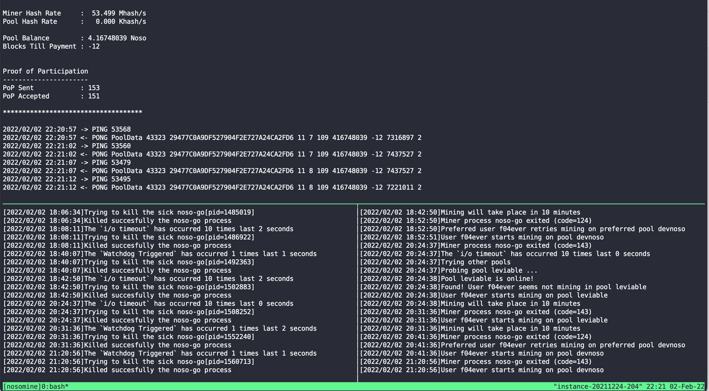

# NosoStuff
Some handy scripts facilitate [Noso Cryptocurrency](https://nosocoin.com) mining, masternode running, checking pools information ...

## FOR MINING USING `noso-go`

### Why I (and you?) need these scripts
Crypto mining is always unstable by many reasons, like the network communication, the softwares themself, ...
That is unavoidable in case of  [Noso Cryptocurrency](https://nosocoin.com), mining on pools ([NosoWallet](https://github.com/Noso-Project/NosoWallet) up to version `v0.2.1Lb1`) using the admirable miner [noso-go](https://github.com/Noso-Project/noso-go) (up to version `v1.6.2`).
`Watchdog triggered`, `POOLFULL`, `BANNED`, `ALREADYCONNECTED`, `PING 0`, or pool offline (`i/o timeout`) ...
These kind of dead events may appear at any time and cause my mining stop while my computers continue running and consuming the electricity until I have time to check and restart the miners

I need tools to:
    - Automatically stop the mining in case of dead events appear.
    - Automatically restart mining or switch to another pool and/or wallet address to continue the mining.

And, here they are! `ngExec.sh`, `ngKill.sh`, `ngTmuxNew.sh`, `ngTmuxEnd.sh`, and `ngTmuxRestart.sh` (`bash` shell scripts)

### Supported OSs/ Platforms:
Linux, Android(Termux), and macOS. Currently not support Windows native someone has set it up well under WSL as same as on a native Linux.

### Required packages: `tmux`, `nc` (`netcat`), `timeout`, `sed`, `grep`, `pgrep`, ...

*** In Linux: Most of these packages are common and installed by default in linux distros:

    - `sudo apt install tmux`

*** In macOS: the `nc` Apple version is bugfull, use the GNU version instead:

    - `brew install tmux netcat grep gnu-sed`

*** In Android/Termux:

    - `pkg install termux netcat-openbsd`

### Quick runing
- Put all relating files in the same folder (ex.: `NosoStuff`) with the `noso-go`
- Set parameters (descripted below)
- Open terminal, go to folder `NosoStuff`
- Set executable permission to script files:
    `chmod +x ngTmuxNew.sh`
    `chmod +x ngTmuxEnd.sh`
    `chmod +x ngTmuxRestart.sh`
    `chmod +x ngExec.sh`
    `chmod +x ngKill.sh`
- Run appropriate commands bellow from shell prompt ($, #, ...):
    `./ngTmuxNew.sh`        # for launching the mining processes
    `./ngTmuxEnd.sh`        # for turning off the mining processes
    `./ngTmuxRestart.sh`    # simplifying the turning of and lauhching again mining processes
- To view the `tmux` session (with mining processes run in) by command:
    `tmux a -tnosomine`
- To close the above `tmux` screen (and let mining processes run) by keystrokes:
    `Ctr-b d`

### Set parameters:
- `POOLS`: List of pools can be used (in file `pools.txt` or `ngExec.sh`)
- `USERS`: List of users (wallet addresses/ aliases) can be used (in file `users.txt` or `ngExec.sh`)
- `CPU`: The number of CPUs the noso-go uses for mining (in file `params.txt` or `ngExec.sh`)
- `SWITCH_DURATION`: Duration in seconds the noso-go does mining in case the selected pool and/or user are not preferred. After this duration, noso-go will try back to mine using the preferred pool and user. Tthe 1st one in POOLS and USERS lists (in file `params.txt` or `ngExec.sh`)
- `TIME_CYCLE`: Duration in seconds periodically (default 5 secs) the noso-go log file be scanned to detect the dead events (in file `params.txt` or `ngExec.sh`)

*** Recommend to set the parameters up using corresponding text files with the same formations as follow:
- Set pool list `POOLS` using file `pools.txt`;
- Set user list `USERS` using file `users.txt`;
- Set other parameters using file `params.txt`;

### How they work

- The `ngExec.sh`: Everytime the miner `noso-go` to be terminated, the `ngExec.sh` do scan the latest lines of `noso-go` log file to find the reason; then tries to select an approriate pool, and/or user; and then restart the miner with those parameters.

- The `ngKill.sh`: peridically 5 seconds (configurable), `ngKill.sh` does scan the latest lines of `noso-go` log file to detect if an dead event appear, and then force killing that sick miner. That gives a chance to the miner to be restarted by the `ngExec.sh` with approriate pool and/or user.

- The combination of both `ngExec.sh` and `ngKill.sh` in parallel is the way staying with dead events during mining, automatically.

- The `ngTmuxNew.sh` and `ngTmuxEnd.sh` utilize for launching and turning off both `ngExec.sh` and `ngKill.sh` at once on a single `tmux` session.

- The `ngTmuxRestart.sh` is just a simplifying of turning of the current mining and then launching it again.

### Supported events
Currently it can catch these simple events:
- `Watchdog triggered` --> restart miner;
- `POOLFULL` --> try another pool;
- `BANNED` --> try another pool;
- `ALREADYCONNECTED` --> try another wallet address, if no more address available, try another pool;
- `PING 0` --> restart miner;
- Pool offline (`i/o timeout` for more than a minute) --> try another pool;

## FOR CHECKING POOLS INFORMATION

- Check pools online or not, show pool information including: hashrate, number of miners, fee, share, ... If associating with users (users.txt), show status of user in pool, including: joining or not, balance, user hash rate, block till payment out.

- Setup: `chmod +x problePools.sh`

- Parameters: `pools.txt` and `users.txt` (optional but recommended)

- Use command: `./probePools.sh`
